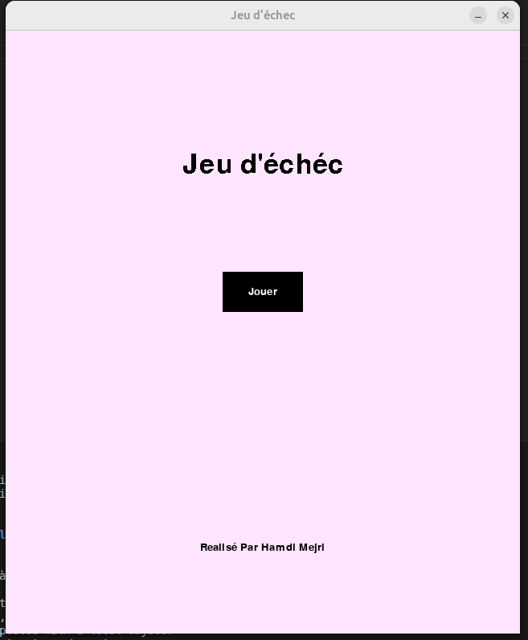
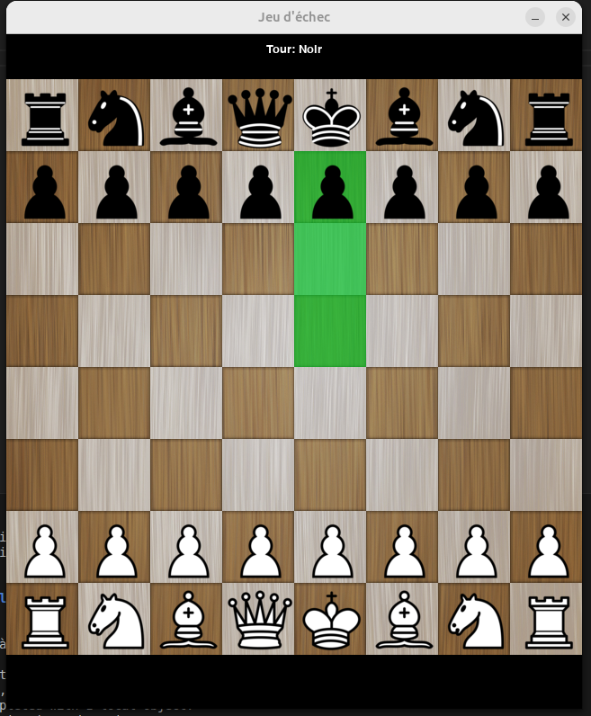

# Jeu d'échecs Python avec Pygame

## Description

Ce projet est une application de jeu d'échecs développée en Python utilisant la bibliothèque **Pygame** pour l'interface graphique. L'application permet de jouer aux échecs avec une interface simple et intuitive.

## Fonctionnalités principales

- Affichage du plateau et des pièces en Pygame
- Gestion des mouvements légaux des pièces
- Interaction utilisateur pour déplacer les pièces
- Affichage des icônes et graphismes personnalisés


## Aperçu du jeu

Voici quelques captures d'écran du jeu en action :





## Prérequis

- Python 3.12+
- Pygame
- Docker (optionnel, pour lancer dans un conteneur)

## Installation locale

1. **Créer un environnement virtuel Python :**
   ```bash
   python3 -m venv venv
   source venv/bin/activate
   ```

2. **Installer les dépendances :**
   ```bash
   pip install pygame
   ```

3. **Lancer le jeu :**
   ```bash
   python main.py
   ```

## Utilisation avec Docker

### Build de l'image Docker

Depuis la racine du projet, exécuter :
```bash
docker build -t jeu-echec .
```

### Lancer le conteneur Docker avec affichage graphique

Pour permettre à Docker d'accéder à l'affichage X11 de ta machine locale, exécuter :
```bash
xhost +local:docker
```

Puis lancer le conteneur :
```bash
docker run -it --rm \
  -e DISPLAY=$DISPLAY \
  -v /tmp/.X11-unix:/tmp/.X11-unix \
  jeu-echec
```

## Notes

- Assure-toi que le dossier `res/` contenant les ressources graphiques (icônes, images) est bien présent dans le projet, car l'application en dépend.
- Le dossier `venv/` est ignoré dans Git via `.gitignore`.

## Auteur

Hamdi Mejri